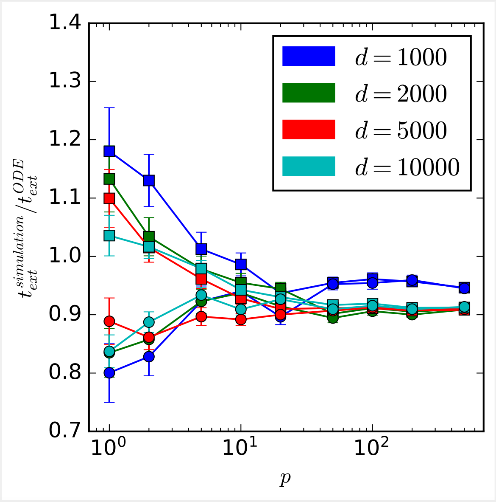
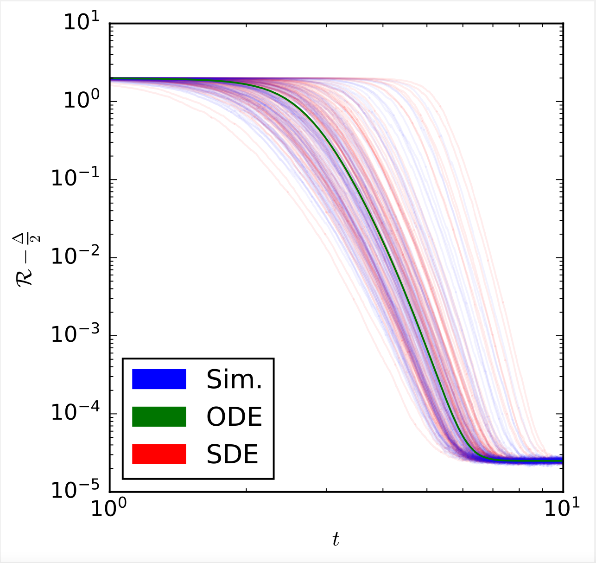

# *Escaping mediocrity*: how two-layer networks learn hard single-index models with SGD

<div width=auto>


</div>

<p><i>
 Left: rates between exit time measurements and our analytical formulae. <br>
 Right: comparison between simulations, ODE integration and SDE integrations, all starting from the same initial conditions.
</i><p>

### Abstract
This study explores the sample complexity for two-layer neural networks to learn a single-index target function under Stochastic Gradient Descent (SGD), focusing on the challenging regime where many flat directions are present at initialization. It is well-established that in this scenario $n=O(d\log{d})$ samples are typically needed. However, we provide precise results concerning the pre-factors in high-dimensional contexts and for varying widths. Notably, our findings suggest that overparameterization can only enhance convergence by a constant factor within this problem class. These insights are grounded in the reduction of SGD dynamics to a stochastic process in lower dimensions, where escaping mediocrity equates to calculating an exit time. Yet, we demonstrate that a deterministic approximation of this process adequately represents the escape time, implying that the role of stochasticity may be minimal in this scenario.

## Structure
 - `committee_learning/`: Python package containing all the code both for simulation and ODEs integration.
 - `how_to_simulate.ipynb`: notebook with an example of SGD dynamics simulation, and ODE & SDE integration.
 - `how_to_measure_exit_time.ipynb`: notebook with an example of measure of exit time.
 - `computation-database/`: folder for previously generated data.
 - `mathematica/`: Mathematica scripts for computing the explicit ODEs.

## Installation
```bash
# Clone the repo (with submodules!)
git clone --recurse-submodules https://github.com/IdePHICS/EscapingMediocrity

cd EscapingMediocrity/
# Install Python requirements
pip install -r requirements
# Install committee_learning package (it requires g++)
pip install -e committee_learning/
```

#### Reference
Luca Arnaboldi, Florent Krzakala, Bruno Loureiro, Ludovic Stephan *Escaping mediocrity: how two-layer networks learn hard single-index models with SGD*, 2023 [https://arxiv.org/abs/2305.18502](https://arxiv.org/abs/2305.18502).
